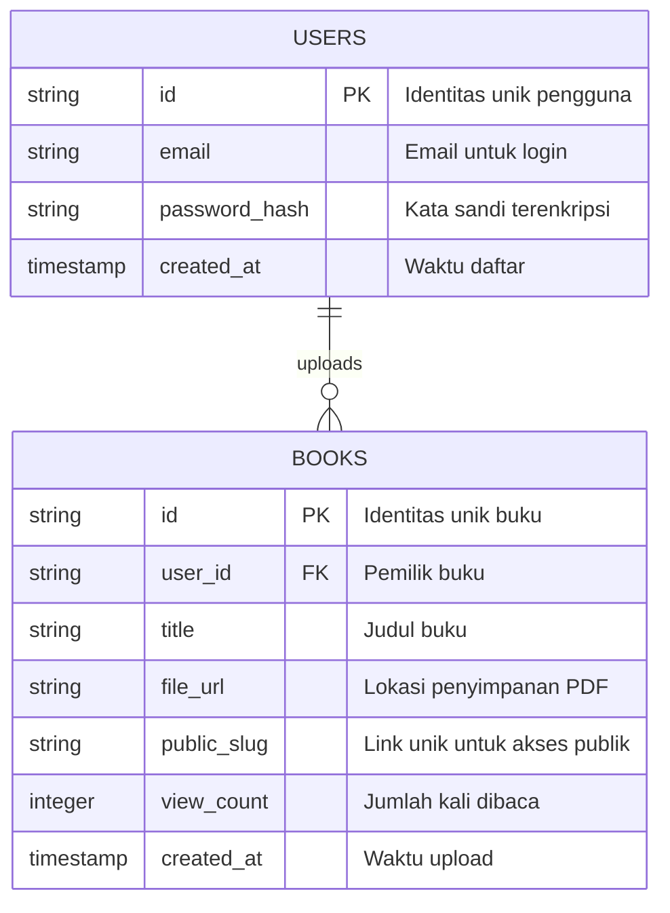

# PRD — Project Requirements Document

## 1. Overview
Aplikasi **Moco** dirancang untuk mengubah dokumen PDF statis menjadi pengalaman membaca buku digital yang interaktif dan menarik. Masalah utama yang diselesaikan adalah kesulitan membaca PDF biasa di perangkat mobile atau web yang terasa kaku. Solusinya adalah mengubah PDF menjadi format "flipbook" (efek balik halaman) yang dapat diakses melalui link unik. Aplikasi ini ditujukan untuk platform publik di mana pengguna umum dapat membaca, sementara uploader harus memiliki akun. Monetisasi dilakukan melalui penempatan iklan yang tidak mengganggu pengalaman membaca.

## 2. Requirements
Berikut adalah persyaratan utama agar aplikasi dapat berjalan sesuai tujuan:
- **Aksesibilitas:** Buku yang sudah diupload harus bisa diakses oleh publik tanpa login, namun proses upload wajib login.
- **Performa:** Halaman buku harus dimuat dengan cepat meskipun berukuran besar, dengan efek animasi halaman yang halus.
- **Keamanan:** Sistem autentikasi yang aman untuk melindungi akun pengguna dan mencegah upload konten berbahaya.
- **Monetisasi:** Terdapat slot iklan yang strategis (misalnya di sela halaman atau sidebar) tanpa menutupi konten utama.
- **Penyimpanan:** Sistem harus mampu menyimpan file PDF dan metadata buku dengan batas ukuran file yang dapat dikonfigurasi (Custom Limit).
- **Branding:** Tampilan standar yang bersih dan fokus pada konten buku.

## 3. Core Features
Fitur-fitur inti yang wajib ada dalam aplikasi ini:
- **Autentikasi Pengguna:** Registasi dan Login untuk pengguna yang ingin mengupload buku.
- **Upload PDF:** Fitur untuk mengunggah file PDF dengan validasi tipe file dan ukuran.
- **Konversi Otomatis:** Sistem backend yang memproses PDF menjadi format yang siap ditampilkan dengan efek balik.
- **Flipbook Viewer:** Tampilan pembaca buku dengan efek membalik halaman (page flip effect) yang responsif di desktop dan mobile.
- **Berbagi Link:** Setiap buku memiliki URL unik yang bisa dibagikan ke media sosial atau pesan langsung.
- **Manajemen Iklan:** Integrasi jaringan iklan untuk menampilkan iklan pada sesi pembacaan.
- **Dashboard Pengguna:** Halaman sederhana bagi uploader untuk melihat daftar buku yang pernah mereka unggah.

## 4. User Flow
Alur perjalanan pengguna dari awal hingga menikmati fitur utama:
1.  **Pengunjung Publik:** Membuka link buku -> Melihat tampilan buku (Flipbook) -> Melihat iklan -> Selesai membaca.
2.  **Uploader (Baru):** Membuka aplikasi -> Klik Login/Register -> Membuat akun -> Verifikasi email (jika ada).
3.  **Uploader (Existing):** Login -> Masuk ke Dashboard -> Klik "Upload Buku" -> Pilih file PDF -> Atur judul & deskripsi -> Proses Upload -> Dapatkan Link Buku.
4.  **Uploader (Manage):** Masuk Dashboard -> Lihat daftar buku -> Salin link untuk dibagikan atau hapus buku.

## 5. Architecture
Sistem menggunakan arsitektur web modern di mana klien berinteraksi dengan server aplikasi yang kemudian mengelola database dan penyimpanan file. Berikut adalah visualisasi alur data saat pengguna mengupload buku:

```mermaid
flowchart TD
    User[Pengguna / Uploader] -->|1. Upload PDF| Client[Frontend - Next.js]
    Client -->|2. Request API| Server[Backend API (PHP Native)]
    Server -->|3. Cek Autentikasi| Auth[Service - Session/Token]
    Auth -->|4. Valid| Server
    Server -->|5. Simpan File| Storage[File Storage]
    Server -->|6. Simpan Metadata| DB[(Database - MySQL)]
    Server -->|7. Konfirmasi| Client
    Client -->|8. Tampilkan Link| User
    Reader[Pembaca Publik] -->|9. Akses Link| Client
    Client -->|10. Ambil Data Buku| Server
    Server -->|11. Ambil File| Storage
    Server -->|12. Sajikan View| Reader
```

## 6. Database Schema
Database diperlukan untuk menyimpan informasi pengguna dan metadata buku. Berikut adalah rancangan tabel utama dan hubungan antar tabelnya:

- **Users:** Menyimpan data akun pengguna yang boleh upload.
- **Books:** Menyimpan informasi tentang buku yang diupload (judul, link file, pemilik).



## 7. Tech Stack
Berdasarkan kebutuhan aplikasi dan standar industri untuk pengembangan yang efisien, berikut adalah rekomendasi teknologi yang akan digunakan:

- **Frontend Framework:** **Next.js** (Berbasis React, memungkinkan performa SEO yang baik untuk halaman buku publik dan interaksi UI yang responsif).
- **Styling:** **Tailwind CSS** (Untuk desain responsif dan cepat) + **shadcn/ui** (Komponen UI standar yang bersih).
- **Backend & API:** **PHP Native** (Tanpa framework berat, menggunakan PDO/MySQLi untuk koneksi database yang efisien dan kontrol penuh).
- **Database:** **MySQL** (Database relasional yang robust, skalabel, dan standar industri untuk hosting PHP).
- **Autentikasi:** **PHP Session & Password Hashing** (Ditangani langsung di backend PHP untuk keamanan akun).
- **File Storage:** **Local Storage** (untuk awal) atau **AWS S3/Cloudflare R2** (untuk produksi skalabel).
- **Deployment:** **VPS / Cloud Hosting** (Seperti DigitalOcean, Linode, atau Shared Hosting yang mendukung PHP & MySQL).
- **Flipbook Library:** **react-pageflip** atau sejenisnya (Untuk efek balik halaman di sisi Frontend).
